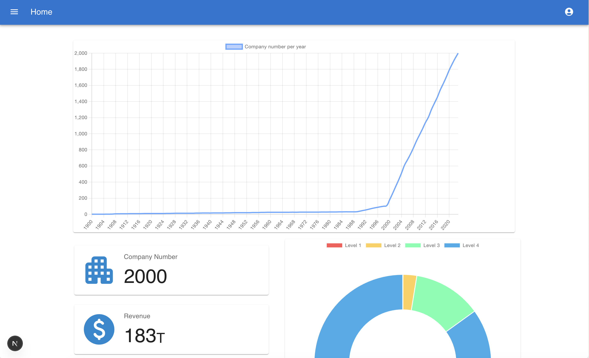
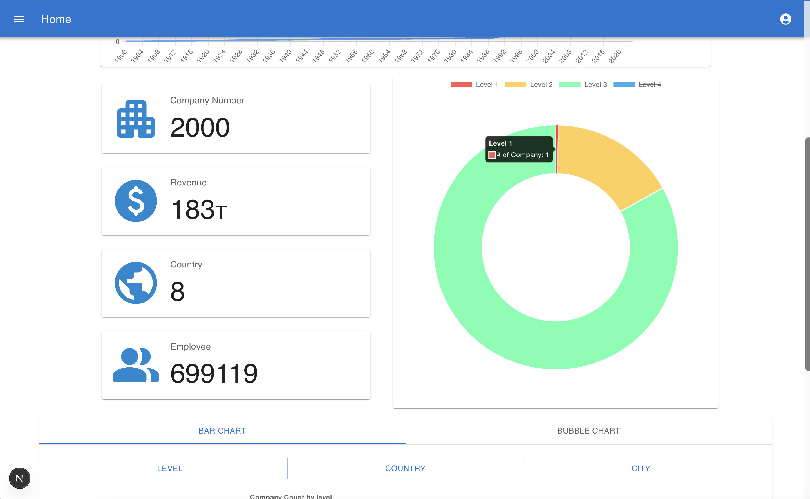
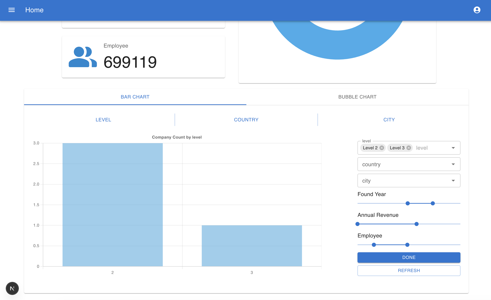
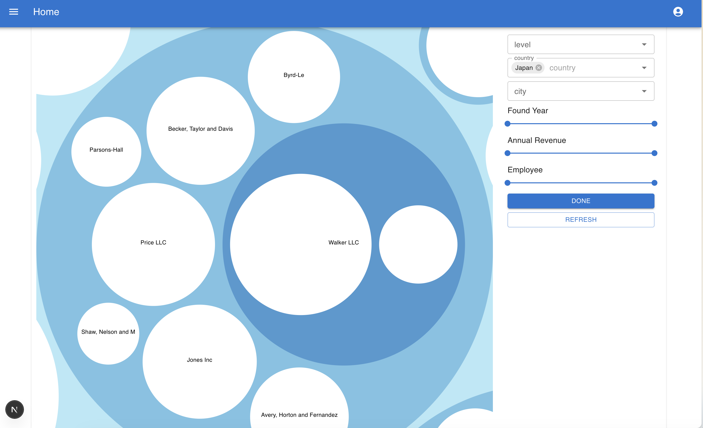
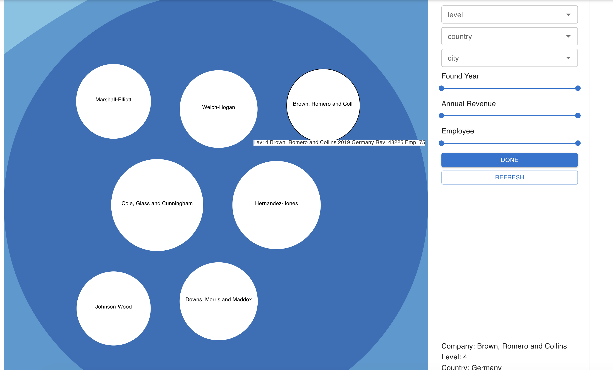
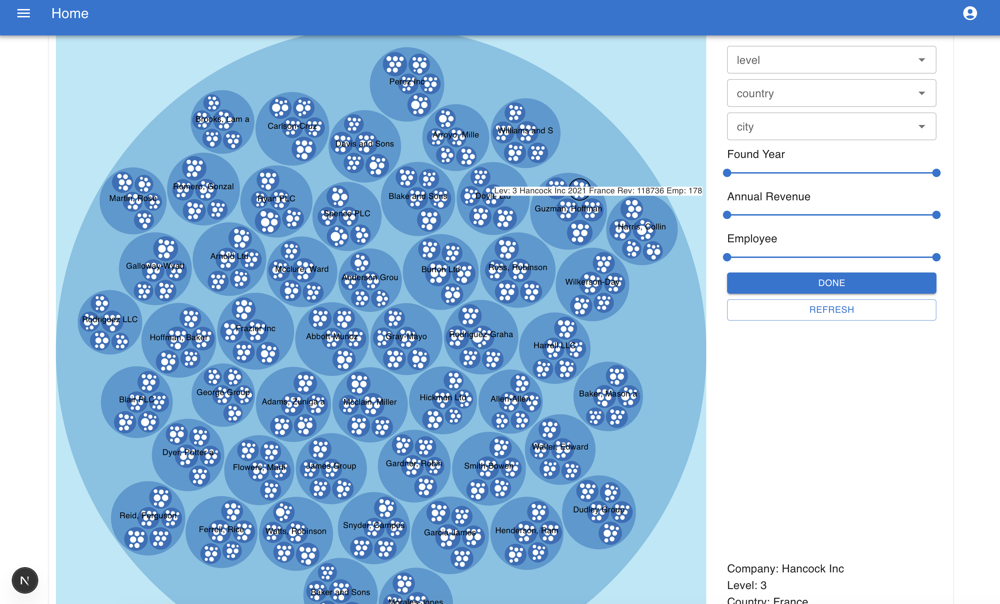
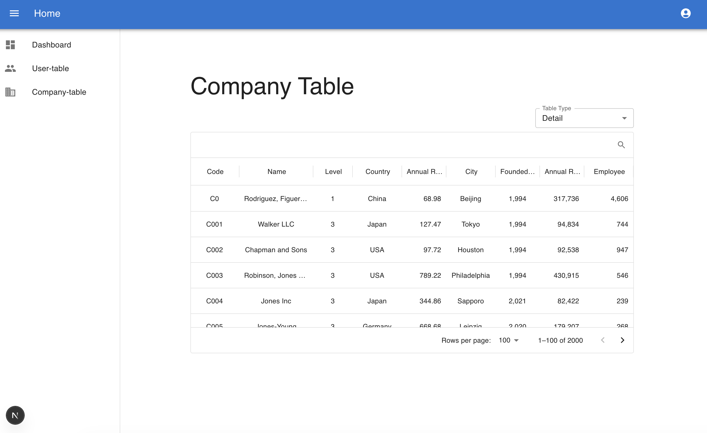
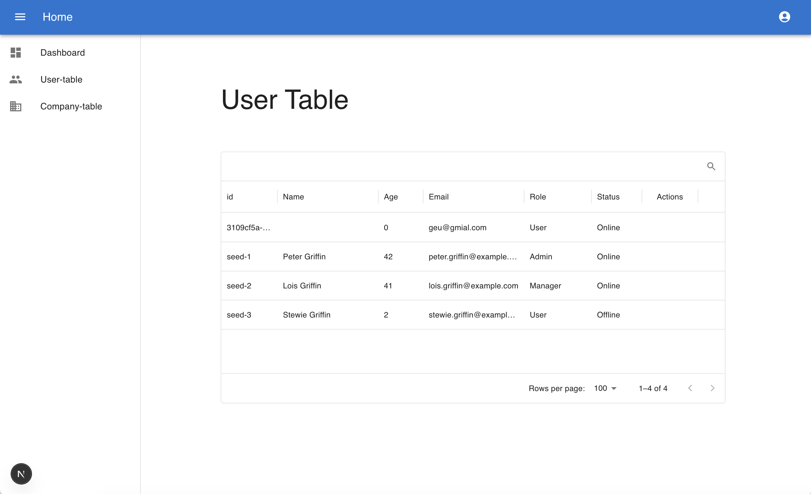
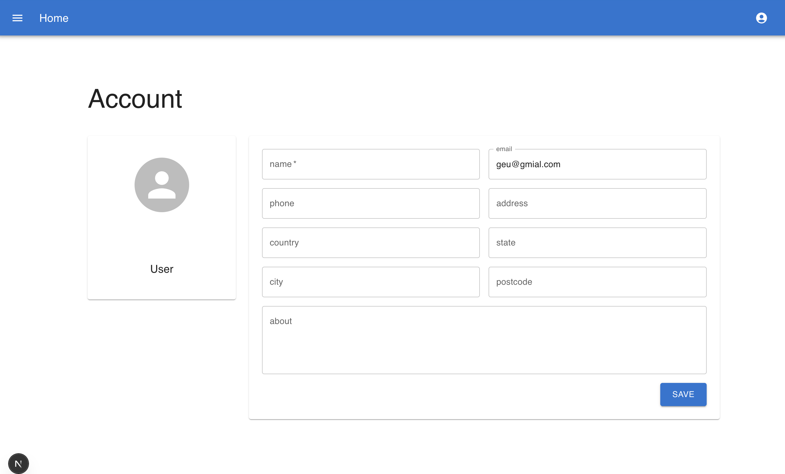

# Company & User Management Dashboard

A full-stack web application for managing companies and users, with analytics dashboards, role-based access control, and interactive data visualizations.

## Tech Stack

| Layer | Technology |
|---|---|
| Frontend | Next.js 15, React 19, TypeScript |
| UI | Material UI (MUI) v6, Chart.js, react-chartjs-2 |
| Backend | NestJS 11, TypeScript |
| Database | MySQL / PostgreSQL via TypeORM |
| Cache | Redis |
| Auth | JWT (cookie-based) |
| API Docs | Swagger / OpenAPI |

## Project Structure

```
company-user/
├── next/     # Frontend (Next.js)
└── nest/     # Backend (NestJS)
```

## Features

### Dashboard

An overview page displaying key company statistics and interactive charts.

**Summary Cards** show totals for company count, revenue, countries, and employees at a glance.



**Line Chart** plots cumulative company registrations by founding year, giving a historical growth view.

**Doughnut Chart** shows the proportional distribution of companies across levels (Level 1–4), with an interactive tooltip on hover.



---

### Bar Chart (Dashboard)

Located in the lower section of the Dashboard. Aggregates company data by **Level**, **Country**, or **City** via tabs.

- A filter panel on the right lets you narrow results by level, country, city, founding year range, annual revenue range, and employee count range.
- Clicking **Done** applies the filters; **Refresh** resets them.



---

### Bubble Chart (Dashboard)

A hierarchical circle-packing visualization where each bubble represents a company. Bubble size encodes a data dimension (e.g. employee count or revenue). Companies at the same level are grouped inside a parent bubble.

- Hovering a bubble shows a tooltip with level, name, founding year, country, revenue, and employee count.
- Clicking reveals a detail panel below the filter sidebar.
- The right-side filter panel supports multi-select dropdowns (level, country, city) and range sliders.







---

### Company Table

A paginated, searchable data grid listing all companies.

- **Table Type** dropdown switches between **Regular** (key columns) and **Detail** (all columns: code, name, level, country, annual revenue, city, founded year, employees).
- A search bar filters rows across all visible columns in real time.
- Inline row editing — click a row to edit fields and save or cancel without leaving the page.
- Managers and Admins can add new companies via the toolbar.
- Admins can delete companies.



---

### User Table

A data grid listing all registered users with columns: id, Name, Age, Email, Role, Status, and Actions.

- Inline editing for user records.
- Add and delete users based on role permissions.
- Search bar for filtering users in real time.



---

### Account Page

Displays the currently authenticated user's profile.

- Shows the user's email (pre-filled and read-only) and role.
- Editable fields: name, phone, address, country, state, city, postcode, and an about bio.
- A **Save** button persists changes to the backend.



---

### Role-Based Access Control

Three roles control what actions a user may perform across the app:

| Role | View | Create | Edit | Delete |
|---|---|---|---|---|
| User | Yes | No | No | No |
| Manager | Yes | Yes | Yes | No |
| Admin | Yes | Yes | Yes | Yes |

New accounts are assigned the `User` role by default.

---

## Getting Started

### Backend (NestJS)

```bash
cd nest
npm install
npm run start:dev
```

The API runs on `http://localhost:3000` by default. Swagger docs are available at `http://localhost:3000/api`.

### Frontend (Next.js)

```bash
cd next
npm install
npm run dev
```

The app runs on `http://localhost:3001` by default.

## API Overview

| Resource | Endpoints |
|---|---|
| Auth | `POST /auth/login`, `POST /auth/signup`, `GET /auth/profile` |
| Companies | `GET /companies`, `PUT /companies`, `DELETE /companies/:id` |
| Company Stats | `GET /companies/widgets`, `GET /companies/panel`, `GET /companies/level` |
| Users | `GET /users`, `PUT /users`, `PATCH /users/:email`, `DELETE /users/:id` |
| Relations | `/relations` (company hierarchy tree) |

Full API documentation is available via Swagger at `/api` when the backend is running. A Postman collection is also provided at `nest/postman/api_collection.json`.
